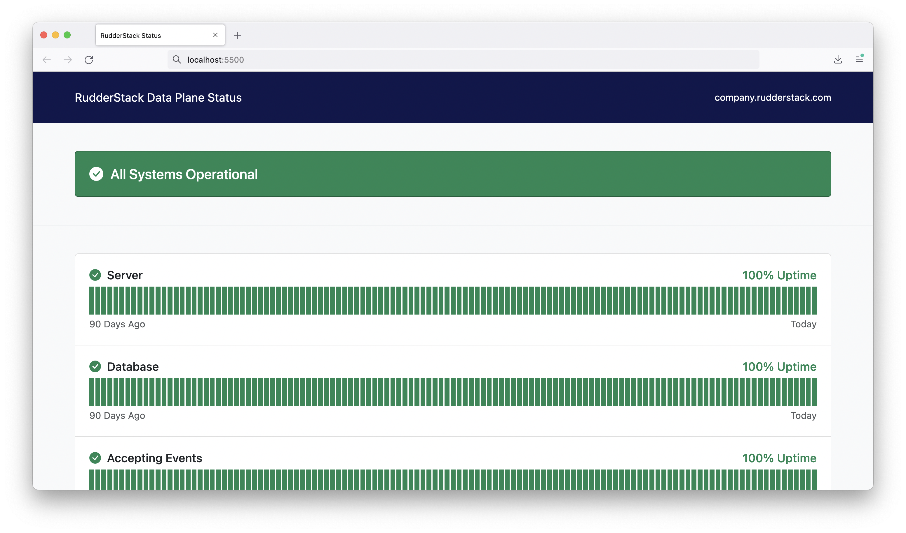

# RudderStack Data Plane Status Page

Monitor the status of your RudderStack Data Plane

## Usage

1. Fork this repository
2. Set your data plane URL in [flat.yml](.github/workflows/flat.yml)
3. Deploy with [GitHub Pages](https://pages.github.com/)

## Screenshot

## License

[MIT](LICENSE)